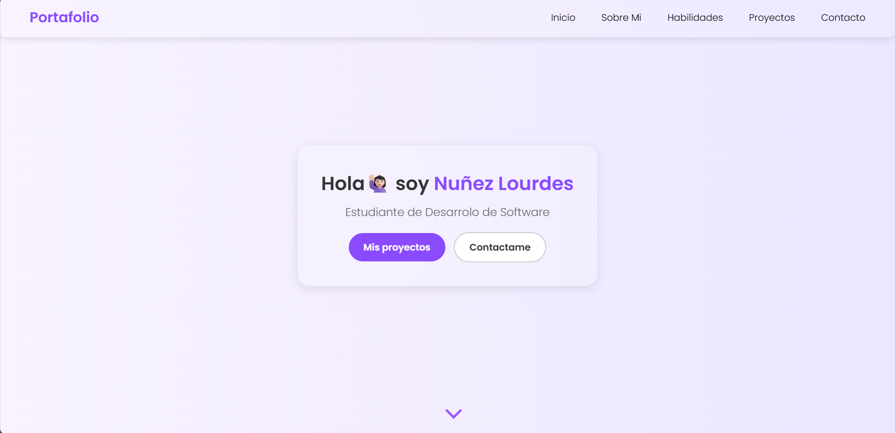
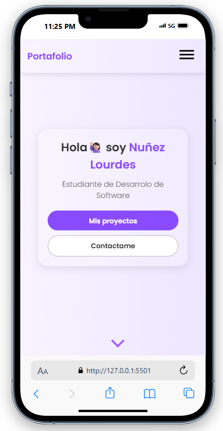

# Portfolio - Lourdes Nuñez

## Descripción

Este portfolio es una aplicación web responsive para:
- Presentar mi perfil
- Mostrar mis habilidades técnicas en frontend, backend y análisis de datos

## Tecnologías utilizadas

- **Frontend**: 
  - HTML5
  - CSS3
  - Diseño responsive con media queries
  - Estilo glassmorphism

- **Herramientas**:
  - Font Awesome para iconos
  - Google Fonts (Poppins)

 ## Características principales

- Menú hamburguesa responsive
- Tarjetas de proyectos interactivas
- Formulario de contacto
- Diseño con efecto glassmorphism
- Adaptable a móviles y tablets

## Cómo Ver el proyecto

El portfolio está desplegado en el siguiente link: https://loununez.github.io/Portafolio-NunezLourdes/
Tambien, clonar el repositorio y abrir el archivo `index.html` en tu navegador
